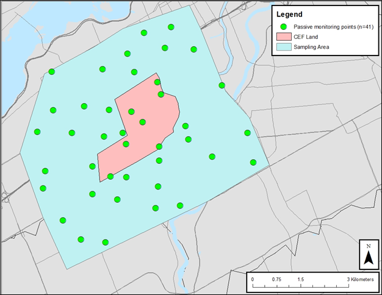

```{r setup, include=FALSE, echo = FALSE, warning = FALSE, message = FALSE}
library(formatR)
library(flextable)
library(tidyverse)
knitr::opts_chunk$set(echo = TRUE)
knitr::opts_chunk$set(tidy.opts=list(width.cutoff=80), tidy=TRUE)
```

```{r Run Analysis, include = FALSE, echo = FALSE, results = 'hide', warning=FALSE, cache = TRUE}
source('CEF_BTEX_main_analysis.R')
```

# Exploratory Data Analysis of BTEX data collected near CEF

Background: Compared to other air sampling studies, this dataset is unique due to the high density of air samplers situated within and around the Central Experimental Farm in Ottawa, Ontario. Unlike other studies, this provides higher data resolution, and we would be able to pinpoint the source of a pollutant. In this case, we are interested in nearest distance to gas stations, since gasoline evaporation is a source of BTEX (Benzene, Toluene, Xylene isomers) VOCs (Volatile Organic Compounds).

We are interested in: BTEX VOC concentrations differences between Fall and Winter, and the relationship between VOC concentrations and distance to the nearest gas station. We hypothesize that generally, BTEX VOC concentration decreases with increased distance from nearest gas station, since



\newpage

# Summary Statistics table

All VOCs and relevant summary statistics are shown in the following table. Note that many species were not detected (100% of samples below detection limit). For subsequent analyses, only VOC species that were detected at least once (\< 100% BDL) were retained.

Keith Notes:
- drop n_BDL
- Drop Q1 and Q3
- drop median
- Fall and Winter Statstics next to eachother (wider format)
- Drop Statistic as a header
- Add some subtle asterisk or P value to show significant different between seasons (Fall-Winter)
- Call this table 1

```{r Summary Table}
#| warning = FALSE,
#| message = FALSE,
#| echo = FALSE


ft = summary_stats_flextable %>%
  flextable::set_table_properties(layout = 'autofit', opts_pdf = list('caption_repeat' = FALSE))
ft
```

\newpage

## Visualizing Fall - Winter Differences in VOC Concentration

Data are visualised on a pseudo-log transformed scale. Dunn test (non parametric) was used to compared the differences in mean concentration between fall and winter seasons for selected BTEX VOC compounds (species with \< 100% BDL). Statistical significance between seasons is denoted as follows - * : P <= 0.05; ** P <= 0.01; *** P <= 0.001; **** P <= 0.0001

Keith Notes:
- Change detection threshold to <80% instead of <100%
- drop chloroform trichloroethylene alpha pinene,

```{r Fall-Winter Differences}
#| fig.height = 6,
#| fig.width = 8,
#| fig.align = 'center',
#| message = FALSE,
#| warning = FALSE,
#| echo = FALSE

print(seasonal_comparison_boxplot)

```

\newpage

## Effect of Gas Station - linear regression models

```{r Gather significant slopes, include = FALSE}
btex_significant_slopes = vector(mode = 'character', length = 0)
for(i in 1:length(lm_results)){
  
  if(lm_results[[i]]$slope_signif < 0.05){
    btex_significant_slopes = c(btex_significant_slopes, paste0(lm_results[[i]]$season, '_', lm_results[[i]]$voc))
  }
}
```

Next we examine the effect of gas station by simple linear regression. Each BTEX VOC compound with detectable values (\< 100% BDL) were analysed using the lm() method, stratified by season. In general, for detected BTEX VOC species, there is a negative effect with distance to gas station (concentration decreases with increasing distance to gas station). For some species such as Benzene, Ethylbenzene,and o-Xylene, the slope is steeper in the winter compared to the fall. Due to the large variance in data (especially due to many data points \< BDL) there are few statistically significant regressions. The slope for the following BTEX species (stratified by season) are statistically significant (P \< 0.05): `r paste(btex_significant_slopes, sep = ', ')`.

Keith Notes:
- 100% below detection in a season should not be represented on a figure, apply 80% cutoff
- Could add a table to tabulate the VOC-season slope and P values to present
- Hexane shows similar relationship between fall and winter, just different baseline level by season

Every season-voc regression that are significant should be tabulated. We can explore other covariates after

Aim to make this paper short in general - explore a simple relationship/effect

```{r Distance to Gas Station Regression}
#| fig.height = 6.5,
#| fig.width = 8.5,
#| fig.align = 'center',
#| message = FALSE,
#| warning = FALSE,
#| echo = FALSE

for(i in 1:length(lm_plots_combined)){
  print(lm_plots_combined[[i]])
}
```
